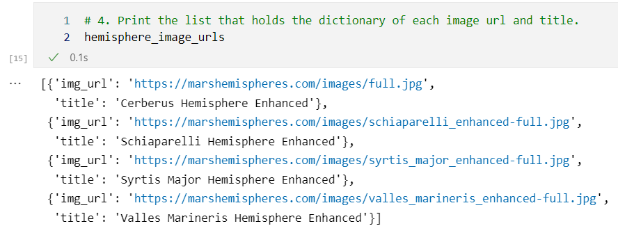
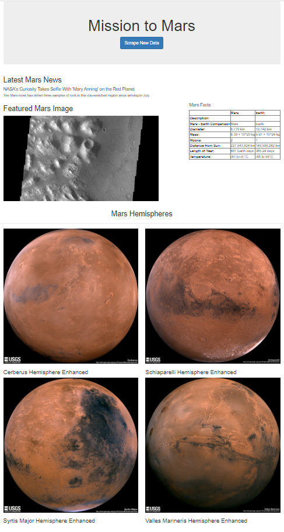
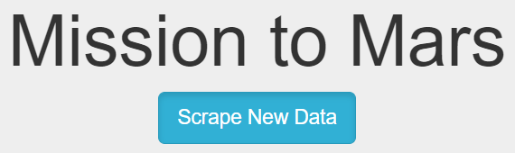
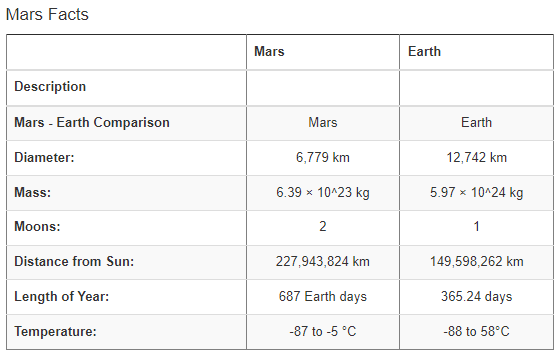
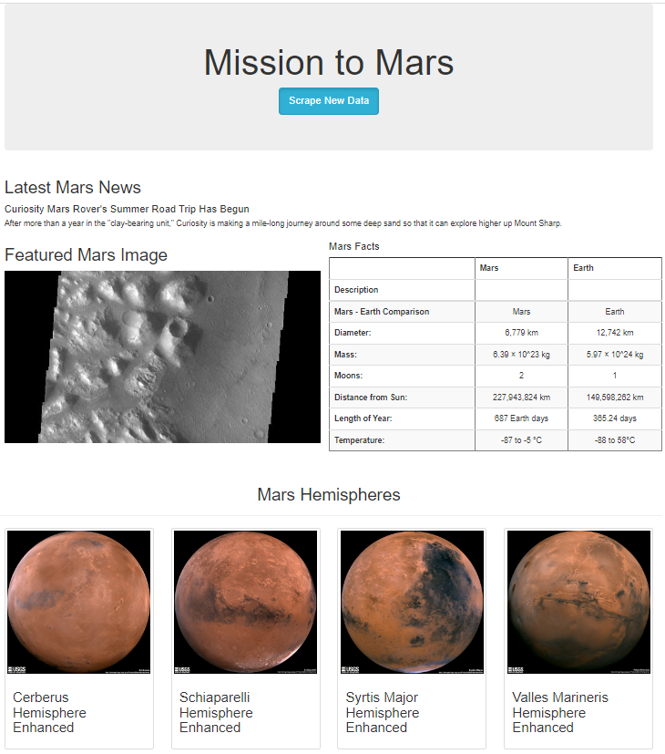

# Mission-to-Mars

## Background

To make the webpage looks more interesting, we will use BeautifulSoup and Splinter to scrape full-resolution images of Mars’s hemispheres and the titles of those images, store the scraped data on a Mongo database, use a web application to display the data, and alter the design of the web app to accommodate these images.

### Results

1. #### Scrape High-Resolution Mars Hemisphere Images and Titles

   We scrape the image URL and title and put it into a dictionary, as shown below:

   

2. #### Update the Web App with Mars Hemisphere Images and Titles

​		With the full resolution images and titles, the updated webpage looks like the following image:

​									 

3. ####  Add Bootstrap 3 Components

   - ##### 	change button to active

     ​	

     

   - ##### change table to striped table

     

   - #####  change the image to thumbnails

​							

